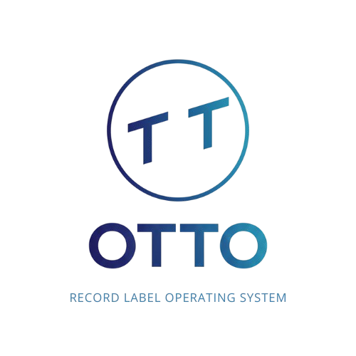

# OTTO - Record Label Operating System



**Version:** 1.0.0 MVP  
**Status:** ✅ Ready for Testing

OTTO is a comprehensive SaaS platform for managing all aspects of a record label's operations, from catalog management to contracts, royalties, and analytics.
---

## 🚀 Quick Start

### Prerequisites
- **Backend**: Python 3.12+
- **Frontend**: Node.js 18+
- **Database**: SQLite (included)

### Installation

#### 1. Backend Setup
```bash
cd backend
python3 -m venv venv
source venv/bin/activate  # On Windows: venv\Scripts\activate
pip install -r requirements.txt
python3 main.py
```

Backend will start on **http://localhost:8000**

#### 2. Frontend Setup
```bash
cd frontend
npm install
npm run dev
```

Frontend will start on **http://localhost:5173**

### 📦 Building MacOS App
To create a standalone `.app` bundle:
```bash
./build.sh
```
This will output `OTTO-Installer-v1.0.0.zip`.
Unzip and drag `OTTO.app` to your Applications folder.

### First Time Setup
1. Navigate to http://localhost:5173
2. Click "Sign up" to create an account
3. Login with your credentials
4. Start managing your label!

---

## ✨ Features

### 📊 Dashboard
- Real-time KPIs (Artists, Releases, Contracts, Revenue)
- AI Assistant card for insights
- Revenue trend charts
- Catalog growth visualization

### 🎵 Catalog Management
- **Artists**: Manage artist profiles with social media, IPI numbers, and relationships
- **Releases**: Track albums, EPs, singles with cover art upload
- **Works**: Manage compositions with composer/arranger details
- **Labels**: Organize your label roster
- **Publishers**: Track publishing relationships
- **PROs**: Manage performance rights organizations

### 📝 Operations
- **Contracts**: Digital contract registry with terms and royalty rates
- **Royalties**: Track royalty statements and payments
- **Documents**: Upload and manage contracts, invoices, reports
- **Notes**: Internal notes and reminders
- **Calendar**: Event management for releases, tours, meetings
- **Playlists**: Curate playlists with drag-and-drop track builder

### 🎨 Modern UI
- OTTO-branded interface with professional design
- Fixed sidebar navigation
- Global search bar
- Skeleton loading states
- Responsive data tables
- Premium form components

---

## 📁 Project Structure

```
project-otto/
├── backend/
│   ├── models/          # Database models (16 entities)
│   ├── routes/          # API endpoints (9 modules)
│   ├── schemas/         # Pydantic validation schemas
│   ├── database.py      # SQLAlchemy configuration
│   ├── config.py        # Application settings
│   └── main.py          # FastAPI application
│
├── frontend/
│   ├── src/
│   │   ├── components/  # Reusable UI components
│   │   ├── pages/       # Page components (15+)
│   │   ├── services/    # API client services
│   │   ├── contexts/    # React contexts
│   │   └── assets/      # Images and static files
│   └── package.json
│
└── uploads/             # File storage directory
```

---

## 🔧 Technology Stack

### Backend
- **Framework**: FastAPI
- **Database**: SQLAlchemy + SQLite
- **Authentication**: JWT (python-jose)
- **File Upload**: python-multipart
- **Validation**: Pydantic

### Frontend
- **Framework**: React 18 + Vite
- **Routing**: React Router v6
- **State**: React Query (TanStack Query)
- **HTTP**: Axios
- **Charts**: Recharts
- **Icons**: Lucide React
- **Styling**: Vanilla CSS (Dealbox-inspired)

---

## 📖 API Documentation

Once the backend is running, visit:
- **Swagger UI**: http://localhost:8000/docs
- **ReDoc**: http://localhost:8000/redoc

### Key Endpoints

#### Authentication
- `POST /auth/register` - Create new account
- `POST /auth/login` - Login and get JWT token

#### Catalog
- `GET /catalog/artists` - List all artists
- `POST /catalog/artists` - Create new artist
- `PUT /catalog/artists/{id}` - Update artist
- `DELETE /catalog/artists/{id}` - Delete artist

*(Similar endpoints for releases, works, labels, publishers, pros)*

#### Operations
- `GET /contracts` - List contracts
- `POST /documents/upload` - Upload file
- `GET /analytics/kpi` - Get dashboard KPIs

---

## 🎯 MVP Scope

### ✅ Completed
- Full authentication system
- Complete catalog CRUD (6 entities)
- Complete operations CRUD (6 modules)
- File upload/download
- Dashboard with analytics
- Modern, branded UI
- Settings page

### 🔮 Future Enhancements
- Mobile app
- Advanced search and filtering
- Bulk operations
- Email notifications
- Multi-organization support (backend ready)
- Dark mode
- Export/Import features
- Advanced analytics and reporting

---

## 🧪 Testing

### Manual Testing Checklist
See [MVP_STATUS.md](MVP_STATUS.md) for complete testing checklist.

### Quick Smoke Test
1. Register and login
2. Create a new artist
3. Create a new label
4. Create a release with cover art
5. Upload a document
6. Create a playlist
7. View dashboard analytics

---

## 📝 Configuration

### Backend (`backend/config.py`)
```python
DATABASE_URL = "sqlite:///./otto.db"
SECRET_KEY = "your-secret-key-here"  # Change in production
UPLOAD_DIR = "./uploads"
MAX_UPLOAD_SIZE = 10 * 1024 * 1024  # 10MB
ALLOWED_EXTENSIONS = [".pdf", ".doc", ".docx", ".jpg", ".png"]
```

### Frontend (`frontend/src/lib/api.js`)
```javascript
const API_URL = 'http://localhost:8000';
```

---

## 🐛 Troubleshooting

### Backend won't start
- Ensure Python 3.12+ is installed
- Activate virtual environment
- Install dependencies: `pip install -r requirements.txt`
- Check if port 8000 is available

### Frontend won't start
- Ensure Node.js 18+ is installed
- Install dependencies: `npm install`
- Check if port 5173 is available

### Database errors
- Delete `otto.db` to reset database
- Backend will recreate tables on startup

### File upload fails
- Ensure `uploads/` directory exists
- Check file size (max 10MB)
- Verify file extension is allowed

---

## 📄 License

Proprietary - All rights reserved

---

## 🙏 Acknowledgments

Built with modern web technologies and inspired by leading SaaS platforms like Dealbox.

---

**For detailed implementation notes, see:**
- [Implementation Plan](implementation_plan.md)
- [Progress Report](progress_report.md)
- [MVP Status](MVP_STATUS.md)
